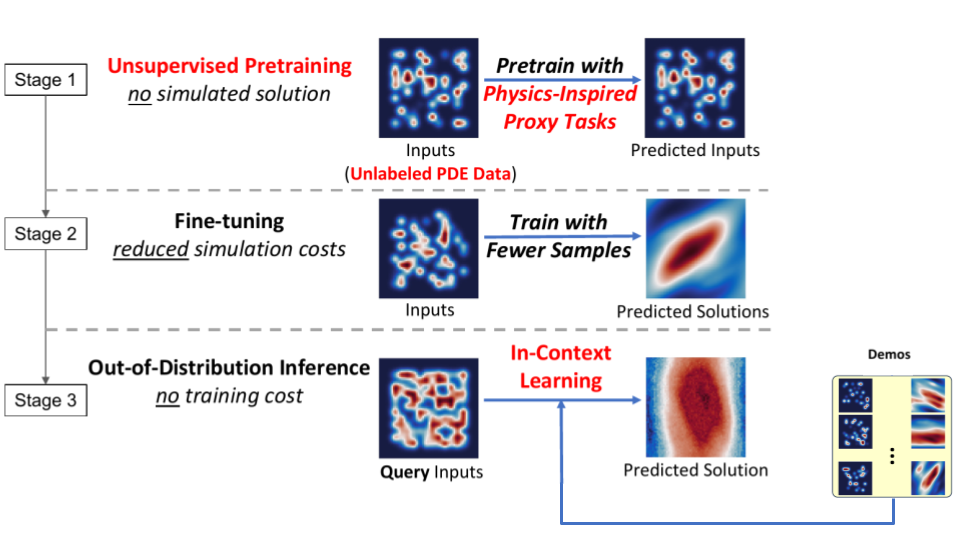

# Data-Efficient Operator Learning via Unsupervised Pretraining and In-Context Learning ([Paper Link](https://arxiv.org/abs/2402.15734))

Jialin Song*, Wuyang Chen*, Pu Ren, Shashank Subramanian, Dmitriy Morozov, Michael W. Mahoney

In NeurIPS 2024.

<p align="center">
    
</p>

## Introduction
In this work, seeking data efficiency, we design unsupervised pretraining for PDE operator learning. To reduce the need for training data with heavy simulation costs, we mine unlabeled PDE data without simulated solutions, and pretrain neural operators with physics-inspired reconstruction-based proxy tasks. To improve out-of-distribution performance, we further assist neural operators in flexibly leveraging a similarity-based method that learns in-context examples, without incurring extra training costs or designs. Extensive empirical evaluations on a diverse set of PDEs demonstrate that our method is highly data-efficient, more generalizable, and even outperforms conventional vision-pretrained models. 

Highlights:
1. We introduce unlabeled PDE data and unsupervised pretraining for data-efficient neural operator learning. We show that our method can achieve better performance than models trained with more simulated PDE solutions, or fine-tuned from public checkpoints pretrained on other benchmarks, demonstrating the importance of unsupervised pretraining on domain-specific PDE data.
2. We propose a similarity-based method to improve the OOD generalization of neural operators, which is flexible and can scale up to a large number of unseen in-context examples (“demos”).
3. We provide detailed empirical evaluations on both diverse PDE benchmarks and also several real-world scenarios, demonstrating that we can achieve both strong forward modeling performance and significant savings in PDE simulations.


## Prerequisites
- SUSE Linux 15.4
- Python 3.9.16
- CUDA 11.7
- NVIDIA A100 (40G)

Configurations may need to be changed on different platforms.


## Environment
Please use the following command to install the necessary packages to run the code.
```
pip install -r requirements.txt
```


## Basic Configurations
The YAML files under `configs/` can be used to control the model and data specs, as well as developer tool [W&B](https://wandb.ai/site/) (to monitor training jobs). 
### Setting parameters
Some vital parameters are listed below:
```
model_type: [vmae, fno] # This controls the model architecture. We use VMAE for Diffusion-Reaction and Incompressible Navier Stokes, FNO for Poisson and Helmholtz data.
```
**There is a difference in adding data paths for the two provided dataloaders:**
- Format for including data path for Diffusion-Reaction and Incomp. Navier Stokes
```
  train_data_paths: [
              ['/path/to/data/PDEBench/2D/NS_incom', 'incompNS', ''],
              ]
  valid_data_paths: [
              ['/path/to/data/PDEBench/2D/NS_incom', 'incompNS', ''],
              ]
```
- Format for including data path for Poisson and Helmholtz
```
  train_path:   '/path/to/poisson_64_e5_15_train.h5'
  val_path:     '/path/to/poisson_64_e5_15_val.h5'
  test_path:    '/path/to/poisson_64_e5_15_test.h5'
  scales_path:  '/path/to/poisson_64_e5_15_train_scale.npy'  # This includes normalization factors for training data.
  train_rand_idx_path: '/path/to/train_rand_idx.npy' # Optional. This contains a manually randomized index sequence for the training data.
```
**To fine-tune a model instead of baseline:**
```
  resuming: False  # This is for resuming a training procedure. To prevent confusion, this flag needs to be False for finetuning.
  pretrained: True
  pretrained_ckpt_path: /pretrained_ckpt_path/training_checkpoints/ckpt.tar  # Include the path for your pretrained checkpoint.
```
### Start training with the set parameters
We've included a `run_pretrain.sh` and `run_finetune.sh` as examples to run the training process.
Another option is to run the one-liner with single GPU usage:
```
python train_basic.py --run_name random_run_name --config config_file_name(./configs/xxx.yaml) --yaml_config yaml_config_name(eg: helm-64-o5_15_ft5_r2)
```


## Data Generation
If you want to generate your own data, we have a dedicated repository [data_generation](https://github.com/jsong2333333/data_generation) that compiles all the data generation pipelines we utilize. A more comprehensive guideline can be found under the repository.

## Poisson, Helmholtz (FNO)

Our implementation is based on Subramanian et al. 2024 "[Towards Foundation Models for Scientific Machine Learning: Characterizing Scaling and Transfer Behavior](https://arxiv.org/abs/2306.00258)" ([Github Link](https://github.com/ShashankSubramanian/neuraloperators-TL-scaling)).

### 1) Data Download:

### 2) Pretraining
```bash
pretrain_basic.py
```

### 3) Fine-tuning
* Use checkpoints by your own [pretraining](#2-pretraining), or download Pretrained checkpoints: [Poisson]() | [Helmholtz]()
```bash
train_basic.py
```

### 4) In-context Learning
* Use checkpoints by your own [fine-tuning](#3-fine-tuning), or download fine-tuned checkpoints: [Poisson]() | [Helmholtz]()
```bash
CUDA_VISIBLE_DEVICES=0 python inference_fno_helmholtz_poisson.py \
--config config/inference_poisson.yaml \
--ckpt_path /path/to/ckpt \
--num_demos 1

CUDA_VISIBLE_DEVICES=0 python inference_fno_helmholtz_poisson.py \
--config config/inference_helmholtz.yaml \
--ckpt_path /path/to/ckpt \
--num_demos 1
```

## Navier-Stokes (FNO)

Our implementation is based on Li et al. 2021 "[Physics-informed Neural Operator for Learning Partial Differential Equation](https://arxiv.org/abs/2111.03794)" ([Github Link](https://github.com/neuraloperator/physics_informed)).

### 1) Data Download: [Google Drive](https://drive.google.com/drive/folders/1-mItthObd2mA0hSpz1iar2JKI092PDK6?usp=sharing)

### 2) Pretraining
```bash
CUDA_VISIBLE_DEVICES=0 python pretrain_fno_ns.py \
--config config/Re100.300.500.800.1000-FNO-pretrain.yaml \
--name test \
--log
```

### 3) Fine-tuning
* Use checkpoints by your own [pretraining](#2-pretraining-1), or download Pretrained checkpoints: [FNO-NS-Pretrained]()
```bash
CUDA_VISIBLE_DEVICES=0 python train_fno_ns.py \
--config config/Re300-1_8-FNO-s.yaml \
--name test \
--ckpt /path/to/pretrained/ckpt \
--log
```

### 4) In-context Learning
* Use checkpoints by your own [fine-tuning](#3-fine-tuning-1), or download fine-tuned checkpoints: [FNO-NS-Finetuned]()
```bash
CUDA_VISIBLE_DEVICES=0 python inference_fno_ns.py \
--config config/inference_fno_ns.yaml \
--ckpt_path /path/to/finetuned/ckpt \
--num_demos 1 \
--tqdm
```


## Reaction-Diffusion (FNO)

Our implementation is based on Takamoto et al. 2022 "[PDEBench: An Extensive Benchmark for Scientific Machine Learning](https://arxiv.org/abs/2210.07182)" ([Github Link](https://github.com/pdebench/PDEBench)).

### 1) Data Download:
- We use the data from **PDEBench** ([Data Download Link](https://darus.uni-stuttgart.de/dataset.xhtml?persistentId=doi:10.18419/darus-2986)).

### 2) Pretraining
```bash
pretrain_basic.py
```

### 3) Fine-tuning
* Use checkpoints by your own [pretraining](#2-pretraining-2), or download Pretrained checkpoints: [FNO-RD-Pretrained]()
```bash
train_basic.py
```


## Navier-Stokes (VMAE)

Our implementation is based on McCabe et al. 2023 "[Multiple Physics Pretraining for Physical Surrogate Models](https://arxiv.org/abs/2310.02994)" ([Github Link](https://github.com/PolymathicAI/multiple_physics_pretraining)).

### 1) Data Download:
- We use the data from **PDEBench** ([Data Download Link](https://darus.uni-stuttgart.de/dataset.xhtml?persistentId=doi:10.18419/darus-2986)).

### 2) Pretraining
```bash
CUDA_VISIBLE_DEVICES=0 python pretrain_basic.py --run_name test --config basic_config --yaml_config ./config/vmae_config_pretrain.yaml
```

### 3) Fine-tuning
* Use checkpoints by your own [pretraining](#2-pretraining-3), or download Pretrained checkpoints: [VMAE-NS-Pretrained]()
```bash
python ckpt_pretrain2train.py # expand the first convolution layer in a net2net-like approach

CUDA_VISIBLE_DEVICES=0 python train_basic.py \
--run_name test \
--config basic_config \
--yaml_config ./config/vmae_config.yaml
```


## ERA5 (VMAE)

### 1) Data Download: [Google Drive]()

### 2) Pretraining
```bash
pretrain_basic.py
```

### 3) Fine-tuning
* Use checkpoints by your own [pretraining](#2-pretraining-4), or download Pretrained checkpoints: [VMAE-ERA5-Pretrained]()
```bash
train_basic.py
```


## ScalarFlow (VMAE)


### 1) Data Download: [Google Drive]()

### 2) Pretraining
```bash
pretrain_basic.py
```

### 3) Fine-tuning
* Use checkpoints by your own [pretraining](#2-pretraining-4), or download Pretrained checkpoints: [VMAE-ScalarFlow-Pretrained]()
```bash
train_basic.py
```


## Airfoil (FNO)


### 1) Data Download: [Google Drive]()

### 2) Pretraining
```bash
pretrain_basic.py
```

### 3) Fine-tuning
* Use checkpoints by your own [pretraining](#2-pretraining-5), or download Pretrained checkpoints: [FNO-Airfoil-Pretrained]()
```bash
train_basic.py
```


<!-- ### Dataloader -->
<!-- Dataloaders can be found at `data_utils/`. This repository currently contains dataloader for the following PDE equations: Poisson, Helmholtz, Diffusion-Reaction and Incompressible Navier Stokes. -->
<!-- - For Poisson and Helmholtz data, we built on the previous work: **Towards Foundation Models for Scientific Machine Learning: Characterizing Scaling and Transfer Behavior** ([Github Link](https://github.com/ShashankSubramanian/neuraloperators-TL-scaling)). -->
<!-- - For Diffusion-Reaction and Incompressible Navier Stokes, we built on the previous work: **Multiple Physics Pretraining for Physical Surrogate Models** ([Github Link](https://github.com/PolymathicAI/multiple_physics_pretraining)). -->


<!---
## Training and Inference
- Configuration files (in YAML format) are in `configs/` for different PDE systems. For example, config for Poisson's is in `configs/operator_poisson.yaml`.  The main configs for the three systems are ``poisson-scale-k1_5``, ``ad-scale_adr0p2_1`` and ``helm-scale-o1_10``. The data paths and scales paths need to be set here. For example, the config at [configs/operator_poisson.yaml](config/operator_poisson.yaml) has the data setup and minimal hyperparameters as follows:
 ```
poisson-scale-k1_5: &poisson_scale_k1_5  # sampled eigenvalues are in (1,5) for diffusion
	  <<: *poisson
	  ... # can change other default configs from poisson if needed #
	  ...
	  train_path:  # path to train data
	  val_path:    # path to validation data
	  test_path:   # path to test data
	  scales_path: # path to train data scales for input normalization 
	  batch_size:       # batch size for training 
	  valid_batch_size: # batch size for validation
	  log_to_wandb:     # switch on for logging to weights&biases
	  mode_cut:         # number of fourier modes to use
	  embed_cut:        # embedding dimension of FNO
	  fc_cut:           # multiplier for last fc layer
``` 
- Data, trainer, and other miscellaneous utilities are in `utils/`. We use standard PyTorch dataloaders and models wrapped with DDP for distributed data-parallel training with checkpointing.
- The FNO model is the standard model and is in `models/`. The hyperparameters used are in the config files for the respective PDE systems.
- Environment variables for DDP (local rank, master port etc) are set in `export_DDP_vars.sh` to be sourced before running any distributed training. See the [PyTorch DDP tutorial](https://pytorch.org/tutorials/intermediate/ddp_tutorial.html) for more details on using DDP. There are other ways to implement this, but our run script is specifically for slurm systems.
- Example running scripts are in `run.sh` (4 GPU DDP train script). ``train.py`` is the training script (``utils/trainer.py``) is the trainer class and ``eval.py`` can be used for inference (``utils/inferencer.py`` is the inference class). See the run scripts for details.

  ```bash
bash run_gen_data.sh
python utils/get_scale.py

CUDA_VISIBLE_DEVICES=0 python train.py --yaml_config=./config/operators_poisson.yaml --config=poisson-scale-k1_5-k2.5_7.5-demo_3 --run_num=bs16_lr1.25e-4_sub100_attn_aug_12 --root_dir=./

CUDA_VISIBLE_DEVICES=0 python eval.py --yaml_config=./config/operators_poisson.yaml --config=poisson-scale-k1_5_demo_7_bs128 --run_num=test --root_dir=/ssd1/chenwy/Mahoney_SciML/neuraloperators-TL-scaling/poisson_demo_7_bs128_2 --weights=poisson_demo_7_bs128/expts/poisson-scale-k1_5_demo_7_bs128/test2/checkpoints/ckpt_best.tar

# can be used to generate feature data
# /pscratch/sd/c/chenwy/neuraloperators-TL-scaling/expts/poisson-scale-k1_5-k10_20/64x64_bs128_lr1e-3_baseline_0927/checkpoints/ckpt_best.tar
CUDA_VISIBLE_DEVICES=0 python eval.py --yaml_config=./config/operators_poisson.yaml --config=poisson-scale-k1_5-k2.5_7.5 --run_num=test --root_dir=/pscratch/sd/c/chenwy/neuraloperators-TL-scaling --weights=/pscratch/sd/c/chenwy/neuraloperators-TL-scaling/expts/poisson-scale-k1_5-k2.5_7.5/64x64_bs128_lr1e-3_baseline_0915/checkpoints/ckpt_best.tar
```
-->

## Citation
```
@inproceedings{chen2024data,
  title={Data-Efficient Operator Learning via Unsupervised Pretraining and In-Context Learning},
  author={Chen, Wuyang and Song, Jialin and Ren, Pu and Subramanian, Shashank and Morozov, Dmitriy and Mahoney, Michael W},
  booktitle={Neural Information Processing Systems},
  year={2024}
}
```

## Acknowledgement
* Subramanian et al. 2024 "[Towards Foundation Models for Scientific Machine Learning: Characterizing Scaling and Transfer Behavior](https://arxiv.org/abs/2306.00258)" ([Github Link](https://github.com/ShashankSubramanian/neuraloperators-TL-scaling)).
* Li et al. 2021 "[Physics-informed Neural Operator for Learning Partial Differential Equation](https://arxiv.org/abs/2111.03794)" ([Github Link](https://github.com/neuraloperator/physics_informed)).
* Takamoto et al. 2022 "[PDEBench: An Extensive Benchmark for Scientific Machine Learning](https://arxiv.org/abs/2210.07182)" ([Github Link](https://github.com/pdebench/PDEBench)).
* McCabe et al. 2023 "[Multiple Physics Pretraining for Physical Surrogate Models](https://arxiv.org/abs/2310.02994)" ([Github Link](https://github.com/PolymathicAI/multiple_physics_pretraining)).